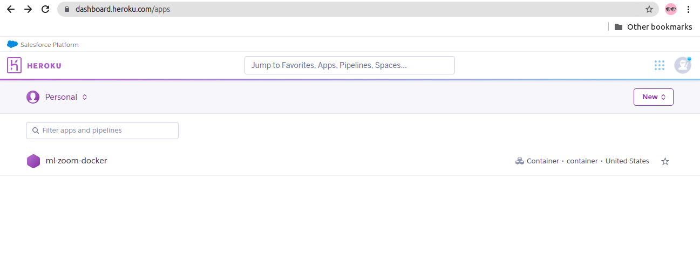
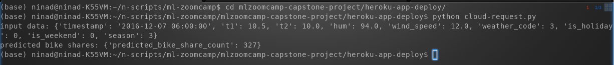

# ML Zoomcamp Capstone Project

This repo contains the work carried out as part of the Capstone project for the course ML Zoomcamp. This course is conducted by Alexey Grigorev. You can take the course at any time and it is free. Links to course mentioned below:

* https://datatalks.club/courses/2021-winter-ml-zoomcamp.html
* https://github.com/alexeygrigorev/mlbookcamp-code/tree/master/course-zoomcamp

## Table of Contents
* [1. About the Project](#about-project)
* [2. Key files and folders explained](#key-files)
* [3. Work explained](#work-explained)
* [4. Virtual environment and package dependencies](#venv)
* [5. Train the model](#train-model)
* [6. Model deployment as a web service on local machine](#deploy-model-local)
* [7. Deploy model as a web service to Docker container](#deploy-model-docker)
* [8. Deploy model as a web service to Heroku Cloud](#deploy-model-cloud)

<a id='about-project'></a>
## 1. About the Project

The purpose of this project is to try predict the future bike shares in London based on the past information on bike sharing in London.

With cost of living increasing day by day, congestion charges levied in many parts of London, the choice of using public transport makes sense to people. But what if you want to travel shorter distances, still have your independence and maintain a healthy lifestyle - thats where bike sharing started (is my assumption). Many organizations like Santander offer public bike sharing schemes with several docking stations across London to help and encourage this lifestyle. However it is also a challenge to maintain the requisite number of bikes. The goal of this project is to try and predict the bike share numbers using Machine Learning.

This is a regression problem.

The trained model can then be deployed as a web service (locally / on a Docker container / in Cloud). Organizations managing bikes for sharing, can then use this service to get predictions on bikes required to be maintained at different times or in different weather conditions. This will also help them plan maintainance of bikes when there could be less demand.

**Acknowledgements:** The dataset is Powered by TfL Open Data. The data contains OS data © Crown copyright and database rights 2016' and Geomni UK Map data © and database rights [2019].

<a id='key-files'></a>
## 2. Key files and folders explained
**Python package dependencies**
>* requirements.txt - Python package dependencies file. Should be used to install packages required for this project.
>* Further explanation in [4. Virtual environment and package dependencies](#venv)

**EDA, Feature analysis, Models, Parameter tuning**
>* london_merged.csv - dataset used for this project.

Kaggle dataset URL:  https://www.kaggle.com/hmavrodiev/london-bike-sharing-dataset

Original data: https://cycling.data.tfl.gov.uk/

License: Please refer to [License for using this data](./License_dataset.md)

>* notebook.ipynb - Jupyter notebook used for the analysis, model exploration, tuning etc. This notebook also has output for all (most) of the cells. The size is big and hence maynot open from github. Better way is to download and open in your Jupyter notebook to see the steps and output.
>* notebook-without-output.ipynb - Above notebook with output stripped to reduce the size. Can view in github also.
>* work-dump - Folder with hyper-parameter tuning scores for various parameter combinations for the models evaluated in thie project

**Model training**
>* train.py - Script to train the final/best model with tuned parameters and save the model file to disk
>* capstone-xgb_model.bin - Saved model file. This file contains the trained XGBoost model (which was the best model, with tuned hyper-parameters).
>* Further explanation in [5. Train the model](#train-model)

**Prediction model as a Web service**
>* predict.py - Prediction model deployed as a Web service using Flask
>* request.py - Sample sript to send request to the Web service (run via predict.py) and display the output (prediction). 

>       To make it convenient to test, few sample data points have been added in the request.py script. You can edit the script and change the index of sample_data_points to use any of these sample datapoints different scenarios. (example below shows index 3, meaning sample 3)
>    
>       details = sample_data_points[3]

>* Further explanation in [6. Model deployment as a web service on local machine](#deploy-model-local)

**Deployment to Docker**
>* app-deploy - Folder having all the necessary files (Dockerfile, model, web service script, request/test script) required for deployment to Docker running locally on your machine.
>* Further explanation in [7. Deploy model as a web service to Docker container](#deploy-model-docker)

**Deployment to Cloud**
>* heroku-app-deploy - Folder having all the necessary files (Dockerfile, model, web service script, request/test script) required for deployment to Heroku cloud.
>* cloud-request.py - Sample sript to send request to the Web service (run via predict.py) running on Heroku cloud and display the output (prediction). Similar to request.py explained above, there are few sample data points provided in the script for testing. 
>* deploy-web-service-to-heroku.md - Provides instructions on how to deploy the Web service to Heroku cloud and test it. Also has screenshots showing the successful deployment to Cloud and a sample test execution (to refer to, incase the Cloud based service is not available when you test)
>* Further explanation in [8. Deploy model as a web service to Heroku Cloud](#deploy-model-cloud)

**Miscellaneous**
>* images - contains screenshots for the cloud deployment instructions 

<a id='work-explained'></a>
## 3. Work explained

Jupyter notebook [notebook.ipynb](./notebook.ipynb) contains all the code for coming up with the ML model for this project. This notebook contains the following:
```
1. About the project
2. Import libraries and load data
3. Exploratory data analysis (EDA)
  3.1 EDA - basic
  3.2 EDA - additional
4. Baseline model
5. Improvement over baseline model
  5.1 Linear Regression
  5.2 Decision Tree
  5.3 Random Forest
  5.4 XGBoost
6. Final model
  6.1 Compare results from hyper-parameter tuning for the different models and choose final model
  6.2 Train final model
```

**Summary**
* This is a regression problem. The data is related to bike shares in London for a period of 2 years and few days, with information on time, weather conditions etc.
* EDA was performed analysing for missing data, data distribution, target feature, feature importance using mutual information between categorical features, correlation of numerical features with target and amongst them, looking for extreme high values, cardinality of categorical features. Performed different transformations to see effect on distribution.
* Baseline model was prepared using Linear Regression
* Data was split into Train (70%), Validation (20%), Test (10%). Further experiments were done on training data, while validating on the validation data (not touching the test data at all)
* Experiments were done to improve the model performance. This involved evaluating model by creating new time related features from the original timestamp feature (e.g. day-of-week, week-of-year etc.). 
* Used standard train_test_split as well as tested cross-validation methods like TimeSeriesSplit and BlockingTimeSeriesSplit.
* Tried using cyclical encoding (using sine and cosine) of time related features. Since time related features are cyclic, e.g. day of week goes from Monday to Sunday and again Monday, models can benefit from cyclical encoding. **In the tests for this dataset however, score did not improve with this encoding**
* Evaluated using other models - DecisionTree, RandomForest and XGBoost
* Parameter tuning of the best experiment for each of the model was done
* Finally compared results from all the model tunings to determine the best model (with best experiment of adding time related features and no encoding) with best hyper-parameters
* Trained final model on full train data (training + validation) and validated on test data, saved model file to disk. Achieved **RMSE of 284** on final model validated on test dataset, which is not so good, but that is what I could achieve.
* Created script to use the prediction model a a web service using Flask
* Deployed the web service to Docker container running on local machine and then to Heroku cloud


<a id='venv'></a>
## 4. Virtual environment and package dependencies
To ensure all scripts work fine and libraries used during development are the ones which you use during your deployment/testing, Python venv has been used to manage virtual environment and package dependencies. Follow the below steps to setup this up in your environment.

The steps to install Python venv will depend on the Operating system you have. Below steps have been provided in reference to installation on Ubuntu, however you can refer to Official documentation at https://docs.python.org/3/tutorial/venv.html to know appropriate steps for your OS.

1. Install pip3 and venv if not installed (below sample commands to be used on Ubuntu hav been provided

```
sudo apt update -y
sudo apt install -y python3-pip python3-venv
```

2. Create a virtual environment. Below command creates a virtual environment named mlzoomcamp

```
python3 -m venv mlzoomcamp
```

3. Activate the virtual environment.

```
. ./mlzoomcamp/bin/activate
```

4. Clone this repo

```
git clone https://github.com/nindate/mlzoomcamp-capstone-project.git
```

5. Change to the directory that has the required files

```
cd mlzoomcamp-capstone-project/
```

4. Install packages required for this project

```
pip install -r requirements.txt
```


<a id='train-model'></a>
## 5. Train the model
You can train the model using below steps.

You can skip steps 1 and 2 below, if your followed instructions in [4. Virtual environment and package dependencies](#venv) above and are now performing these steps.

1. Activate the virtual environment if not done already. Follow the steps in [4. Virtual environment and package dependencies](#venv)

2. Clone this repo (if you have not done already)

```
git clone https://github.com/nindate/mlzoomcamp-midterm-project.git
```

3. Check whether you are already in the project directory which you cloned from git. If not change to that directory.

```
pwd
```

If output of above commands does not show mlzoomcamp-capstone-project at the end, it means you are not in the project directory you cloned. In that case change to the project directory (Below command assumes you are in the directory from where you ran the git clone command above)

```
cd mlzoomcamp-capstone-project/
```

4. Run the training script

```
python train.py
```

<a id='deploy-model-local'></a>
## 6. Model deployment as a web service on local machine
For actual use of a model in real world, it needs to be deployed as a service (application) so that users (Organizations managing bike shares) can use this service. They can now send the details of a particular day to the service and get a prediction on possible number of bikes shares on that day. 

To test the model deployment as a web service - open 2 separate terminal sessions into your machine (where all this code resides) and activate the virtual environment as explained in [4. Virtual environment and package dependencies](#venv)

From one terminal session run the following command to host the prediction model as a web service.

```
gunicorn --bind 0.0.0.0:9696 predict.py
```

From other terminal session from the cloned project directory, execute the following command to make a request to this web service

```
python request.py
```

<a id='deploy-model-docker'></a>
## 7. Deploy model as a web service to Docker container
You can deploy the trained model as a web service running inside a docker container on your local machine.

*Pre-requisites: You should have Docker installed and running on the machine where you want to perform model deployment to docker.*
Run the below commands to check whether docker service is running and then to see if any docker containers are running.

```
systemctl status docker
docker ps -a
```

Following are the steps to do this:
1. Clone this repo (if you have not done this already. If done then skip this step)

```
git clone https://github.com/nindate/mlzoomcamp-capstone-project.git
```

2. Change to the directory that has the model file, python script (predict.py) for the web service and other required files

```
cd mlzoomcamp-capstone-project/app-deploy
```

3. Build docker image named bikes-shares

```
docker build -t "bike-shares" .
```

4. Check docker image available. Output of below command should show the image with name bike-shares

```
docker images
```

5. Create a docker container from the image. The model prediction script as a web service will then be running inside this container. Below command will create and run a docker container named bike-shares-cont (**--name bike-shares-cont**) running as a daemon i.e. non-interactive mode (**-d**), mapping the port 9696 on host to port 9696 on container (**-p 9696:9696** first port is host port, second is container port. If you want to map different port on host just change the first number), from image **bikes-shares**. The container will be deleted if stopped or when you shutdown your machine (**--rm**).

```
docker run --rm --name bike-shares-cont -d -p 9696:9696 bike-shares
```

6. Check whether docker container running. Below command should show the container in Running state and not Exited.

```
docker ps -a
```

7. Test sending some sample data to the web service and see the results. For this you can use the request.py script provided as part of this repo, which has some sample data points and can make a request to the Web app service. Ensure you have activated the virtual environment as explained in [4. Virtual environment and package dependencies](#venv).

Check whether you are already in the project directory which you cloned from git. If not change to that directory.

```
pwd
```

If output of above commands does not show mlzoomcamp-capstone-project at the end, it means you are not in the project directory you cloned. In that case change to the project directory (Below command assumes you are in the directory from where you ran the git clone command above)

```
cd mlzoomcamp-capstone-project/
```

Run the script request.py to send a request to the web service running inside the docker container

```
python request.py
```


<a id='deploy-model-cloud'></a>
## 8. Deploy model as a web service to Heroku Cloud
You can deploy the trained model as a web service to cloud. The steps to perform this deployment to Heroku cloud, screenshots showing service running from cloud and successful response (prediction) returned from this service has been explained and shown in [this](./deploy-web-service-to-heroku.md) document.

Screenshots of successful app deployment in Heroku and successful response (prediction) from the service

Following screenshot shows successful Web app deployed in Heroku cloud



Following screenshot shows successful response from the Web app deployed in Heroku cloud


